# Condition Cards
*Source: Dungeon Master's Screen: Dungeon Kit*  

> [!note]
> These double-sided cards can be used to track conditions by your players; either physically with the "printed copies", or in a VTT.

## Cards

### Deafened
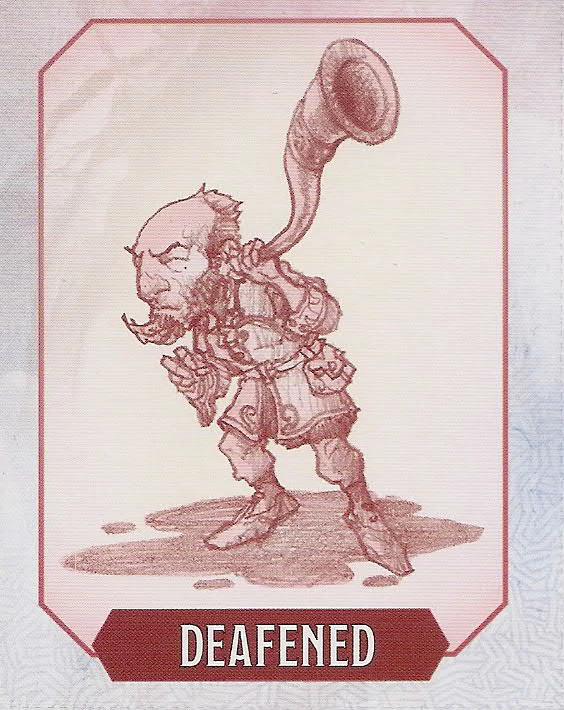
> [!embed-condition]- Deafened
> 

### Charmed
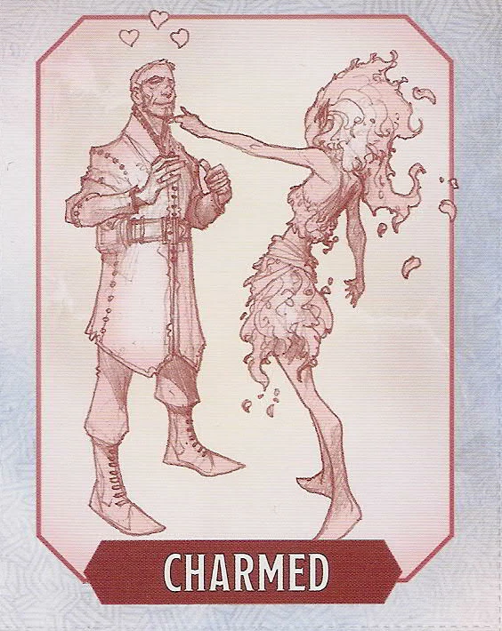
> [!embed-condition]- Charmed
> 

### Blinded
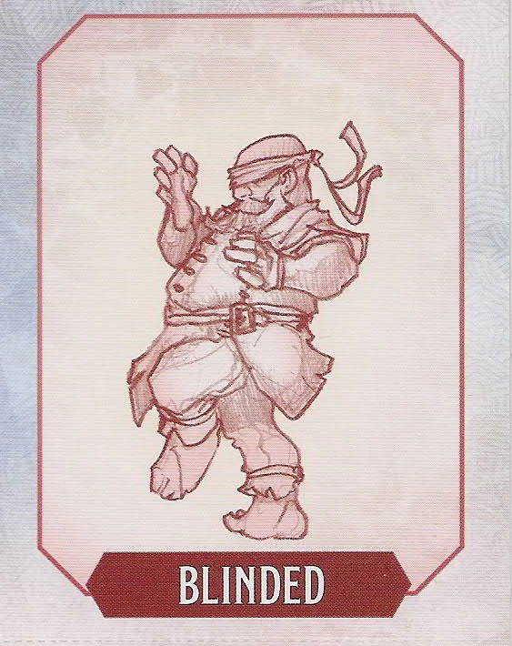
> [!embed-condition]- Blinded
> 

### Incapacitated
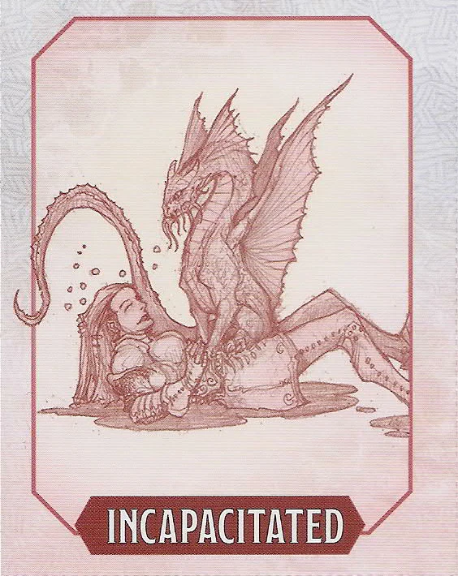
> [!embed-condition]- Incapacitated
> 

### Grappled
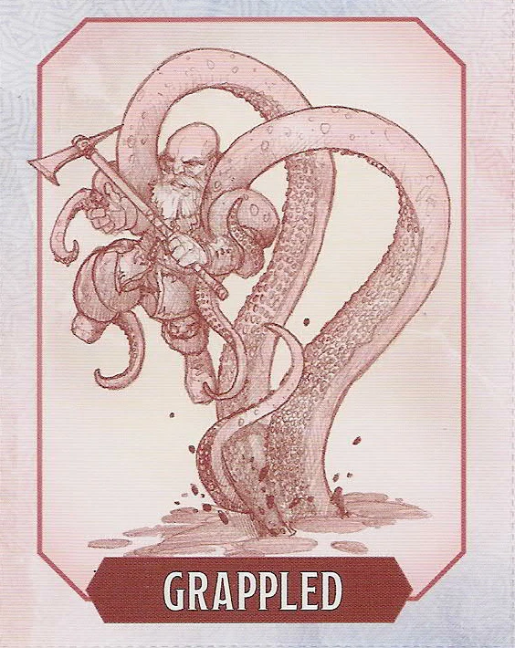
> [!embed-condition]- Grappled
> 

### Frightened
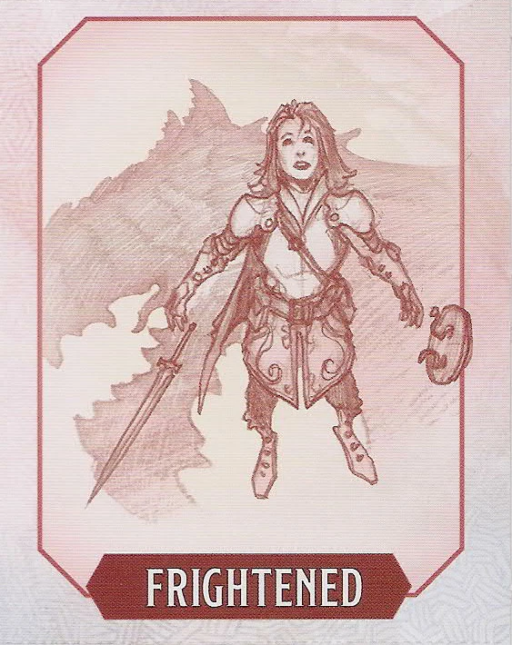
> [!embed-condition]- Frightened
> 

### Petrified
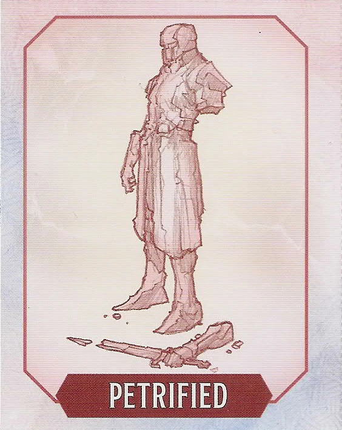
> [!embed-condition]- Petrified
> 

### Paralyzed
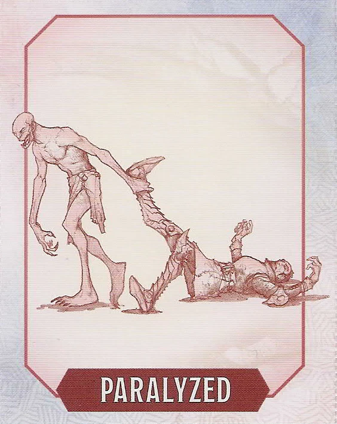
> [!embed-condition]- Paralyzed
> 

### Invisible
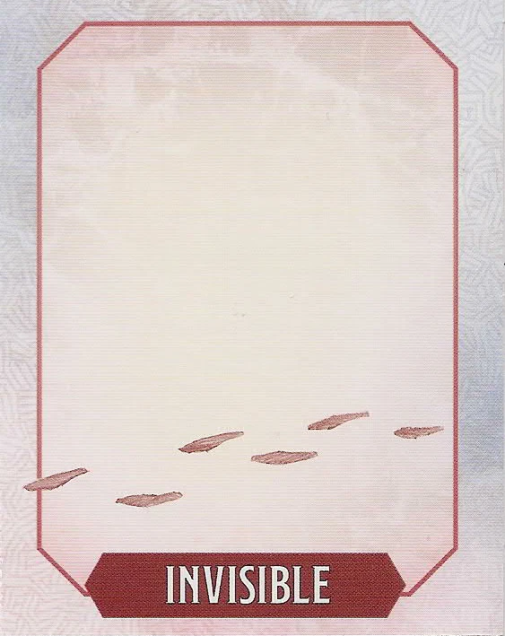
> [!embed-condition]- Invisible
> 

### Restrained
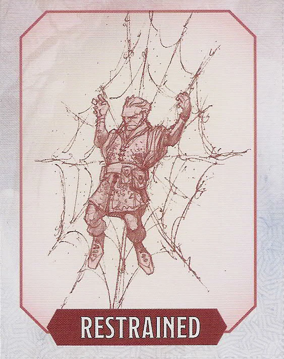
> [!embed-condition]- Restrained
> 

### Prone
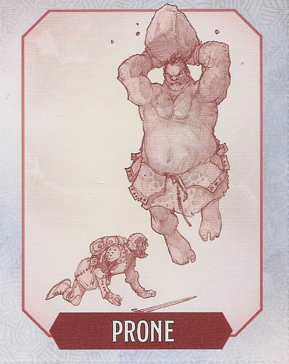
> [!embed-condition]- Prone
> 

### Poisoned
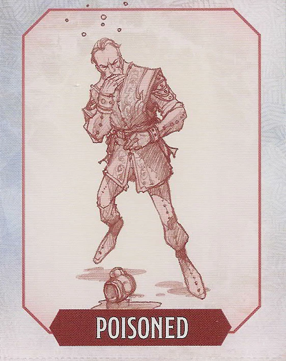
> [!embed-condition]- Poisoned
> 

### Exhaustion
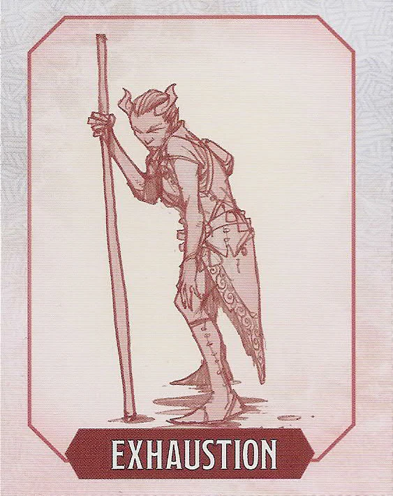
> [!embed-condition]- Exhaustion
> 

### Unconscious
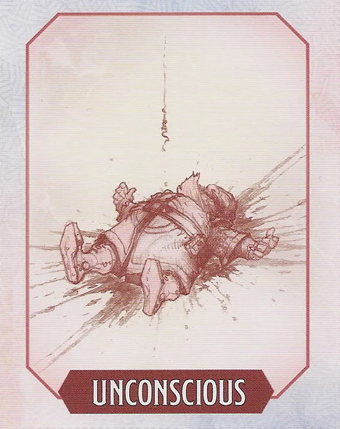
> [!embed-condition]- Unconscious
> 

### Stunned
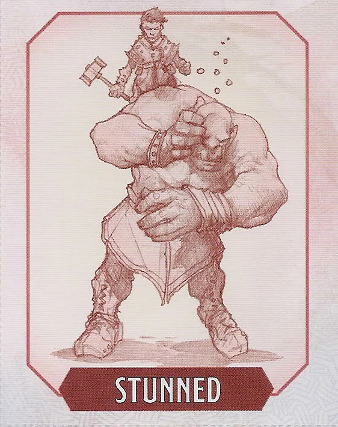
> [!embed-condition]- Stunned
> 