# Deck of Many Things (13 Cards)
*Source: Dungeon Master's Guide p. 162, Derived from . Available in the SRD.*  

Usually found in a box or pouch, this deck contains a number of cards made of ivory or vellum. Most (75% chance) of these decks have only thirteen cards, but the rest have twenty-two.

Before you draw a card, you must declare how many cards you intend to draw and then draw them randomly (you can use an altered deck of playing cards to simulate the deck). Any cards drawn in excess of this number have no effect. Otherwise, as soon as you draw a card from the deck, its magic takes effect. You must draw each card no more than 1 hour after the previous draw. If you fail to draw the chosen number, the remaining number of cards fly from the deck on their own and take effect all at once.

Once a card is drawn, it fades from existence. Unless the card is the [Fool](./deck-of-many-things.md##Fool) or the [Jester](./deck-of-many-things.md##Jester), the card reappears in the deck, making it possible to draw the same card twice.

## A Question of Enmity

Two of the cards in a deck of many things can earn a character the enmity of another being. With the [Flames](./deck-of-many-things.md##Flames) card, the enmity is overt. The character should experience the devil's malevolent efforts on multiple occasions. Seeking out the fiend shouldn't be a simple task, and the adventurer should clash with the devil's allies and followers a few times before being able to confront the devil itself.

In the case of the [Rogue](./deck-of-many-things.md##Rogue) card, the enmity is secret and should come from someone thought to be a friend or an ally. As Dungeon Master, you should wait for a dramatically appropriate moment to reveal this enmity, leaving the adventurer guessing who is likely to become a betrayer.

| 1d13 | Card |
|------|------|
| 1 | [Sun](./deck-of-many-things.md##Sun) |
| 2 | [Moon](./deck-of-many-things.md##Moon) |
| 3 | [Star](./deck-of-many-things.md##Star) |
| 4 | [Throne](./deck-of-many-things.md##Throne) |
| 5 | [Key](./deck-of-many-things.md##Key) |
| 6 | [Knight](./deck-of-many-things.md##Knight) |
| 7 | [The Void](./deck-of-many-things.md##The Void) |
| 8 | [Flames](./deck-of-many-things.md.md##Flames) |
| 9 | [Skull](./deck-of-many-things.md##Skull) |
| 10 | [Ruin](./deck-of-many-things.md##Ruin) |
| 11 | [Euryale](./deck-of-many-things.md##Euryale) |
| 12 | [Rogue](./deck-of-many-things.md.md##Rogue) |
| 13 | [Jester](./deck-of-many-things.md.md##Jester) |
^1-card

## Cards

### Sun
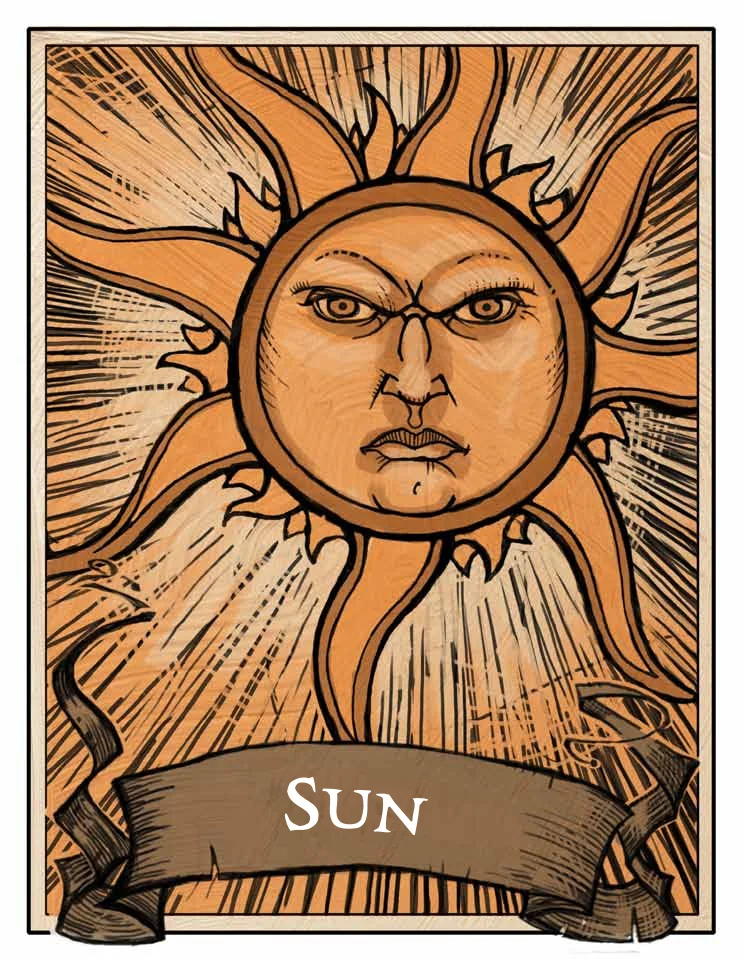
You gain 50,000 XP, and a wondrous item (which the DM determines randomly) appears in your hands.

### Moon
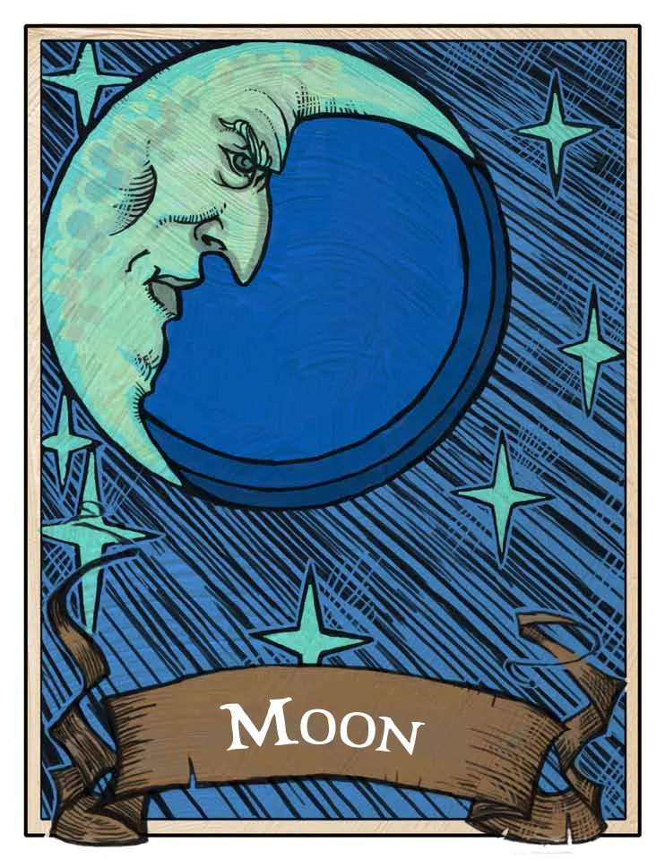
You are granted the ability to cast the [wish](../spells/wish.md#) spell `1d3` times.

### Star
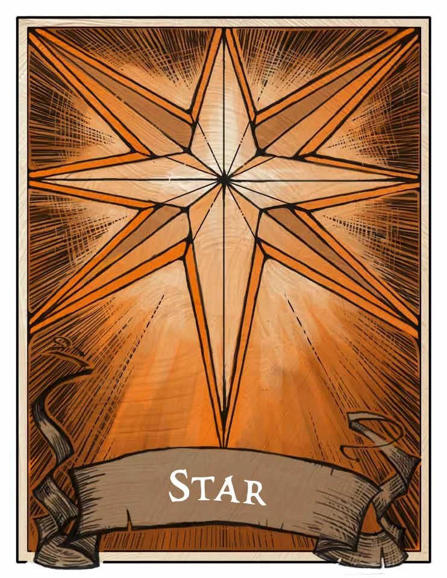
Increase one of your ability scores by 2. The score can exceed 20 but can't exceed 24.

### Throne
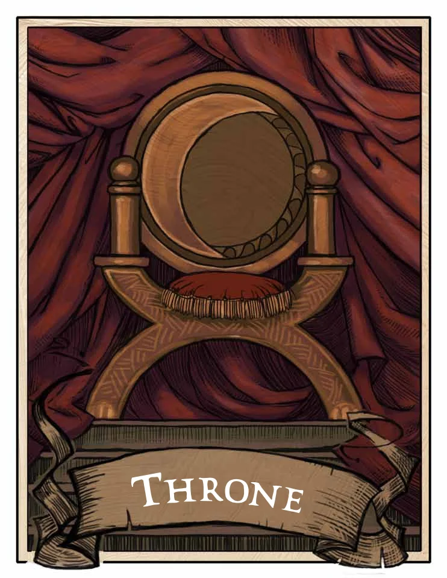
You gain proficiency in the [Persuasion](../../5e-rules/skills.md##Persuasion) skill, and you double your proficiency bonus on checks made with that skill. In addition, you gain rightful ownership of a small keep somewhere in the world. However, the keep is currently in the hands of monsters, which you must clear out before you can claim the keep as yours.

### Key
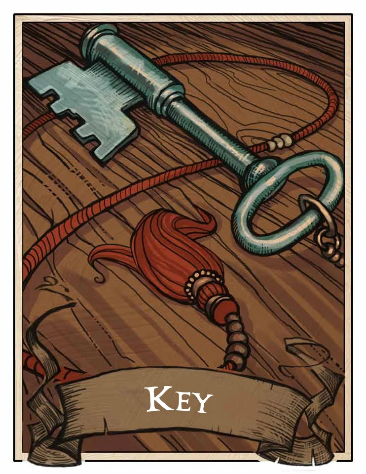
A rare or rarer magic weapon with which you are proficient appears in your hands. The DM chooses the weapon.

### Knight
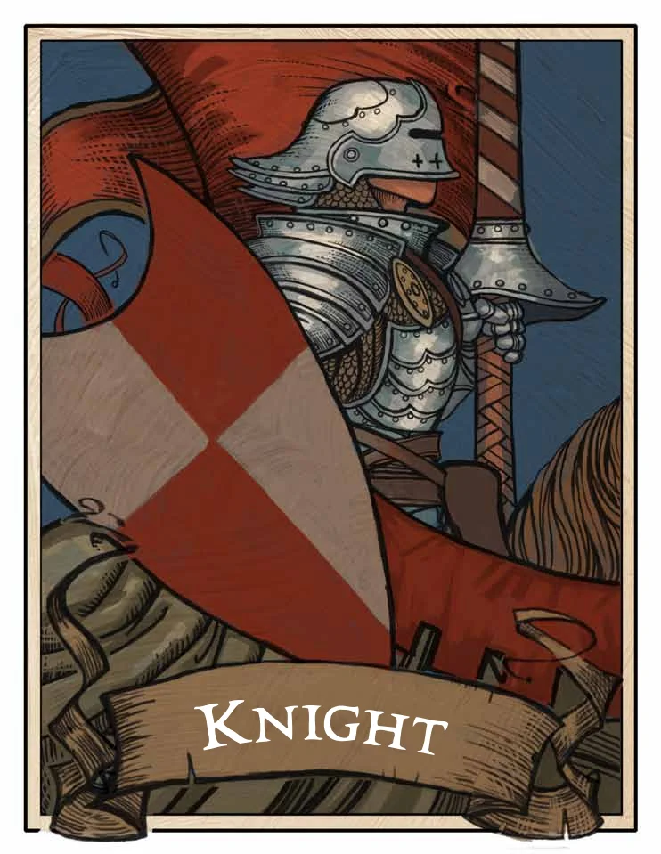
You gain the service of a 4th-level fighter who appears in a space you choose within 30 feet of you. The fighter is of the same race as you and serves you loyally until death, believing the fates have drawn him or her to you. You control this character.

### The Void
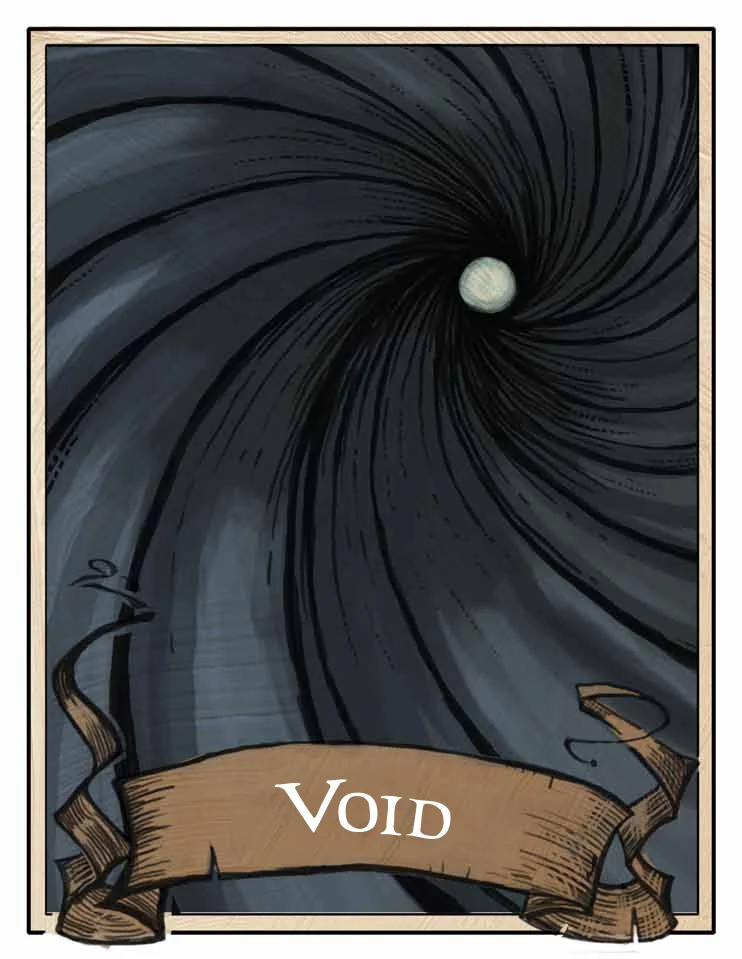
This black card spells disaster. Your soul is drawn from your body and contained in an object in a place of the DM's choice. One or more powerful beings guard the place. While your soul is trapped in this way, your body is [incapacitated](../../5e-rules/conditions.md##incapacitated). A [wish](../spells/wish.md#.md#) spell can't restore your soul, but the spell reveals the location of the object that holds it. You draw no more cards.

### Flames
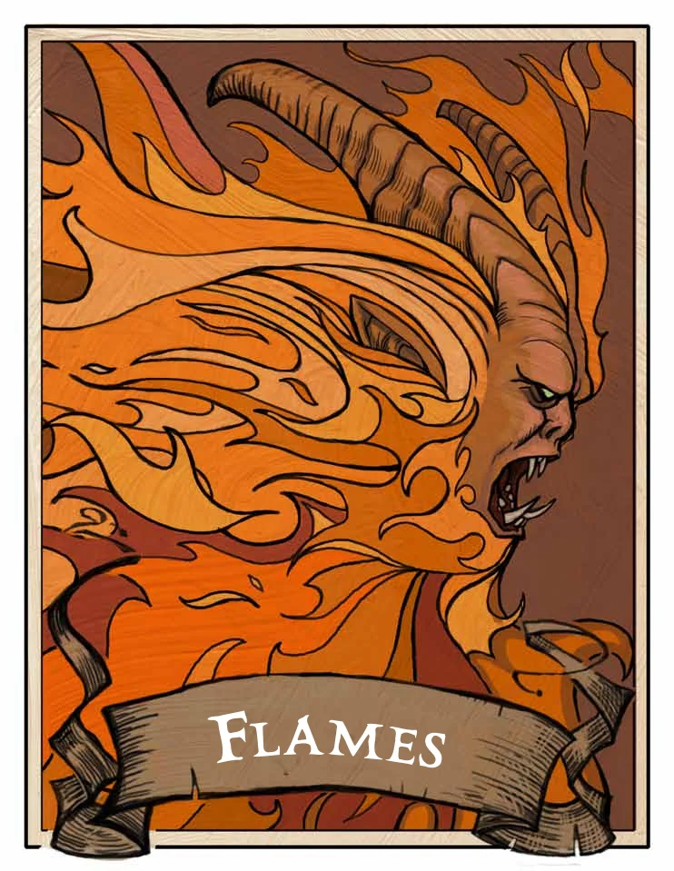
A powerful devil becomes your enemy. The devil seeks your ruin and plagues your life, savoring your suffering before attempting to slay you. This enmity lasts until either you or the devil dies.

### Skull
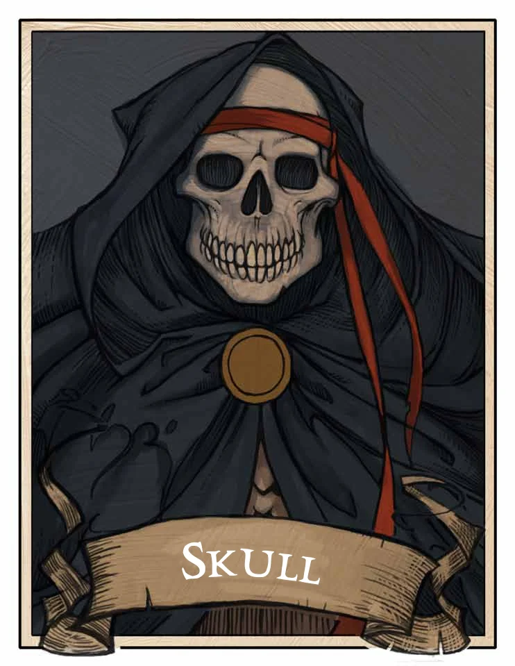
You summon an [avatar of death](avatar-of-death-dmg.md#)—a ghostly humanoid skeleton clad in a tattered black robe and carrying a spectral scythe. It appears in a space of the DM's choice within 10 feet of you and attacks you, warning all others that you must win the battle alone. The avatar fights until you die or it drops to 0 hit points, whereupon it disappears. If anyone tries to help you, the helper summons its own [avatar of death](avatar-of-death-dmg.md#). A creature slain by an [avatar of death](avatar-of-death-dmg.md#) can't be restored to life.

### Ruin
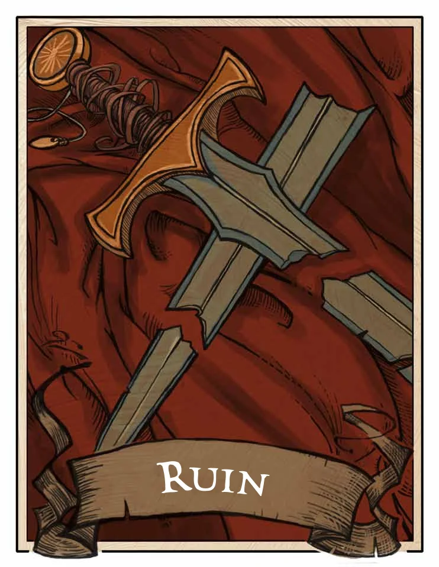
All forms of wealth that you carry or own, other than magic items, are lost to you. Portable property vanishes. Businesses, buildings, and land you own are lost in a way that alters reality the least. Any documentation that proves you should own something lost to this card also disappears.

### Euryale
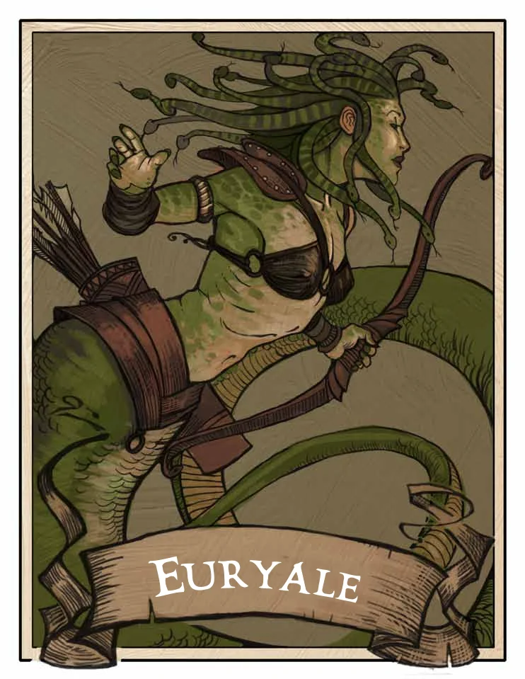
The card's [medusa](medusa.md#)-like visage curses you. You take a −2 penalty on saving throws while cursed in this way. Only a god or the magic of [The Fates](./deck-of-many-things.md##The Fates) card can end this curse.

### Rogue
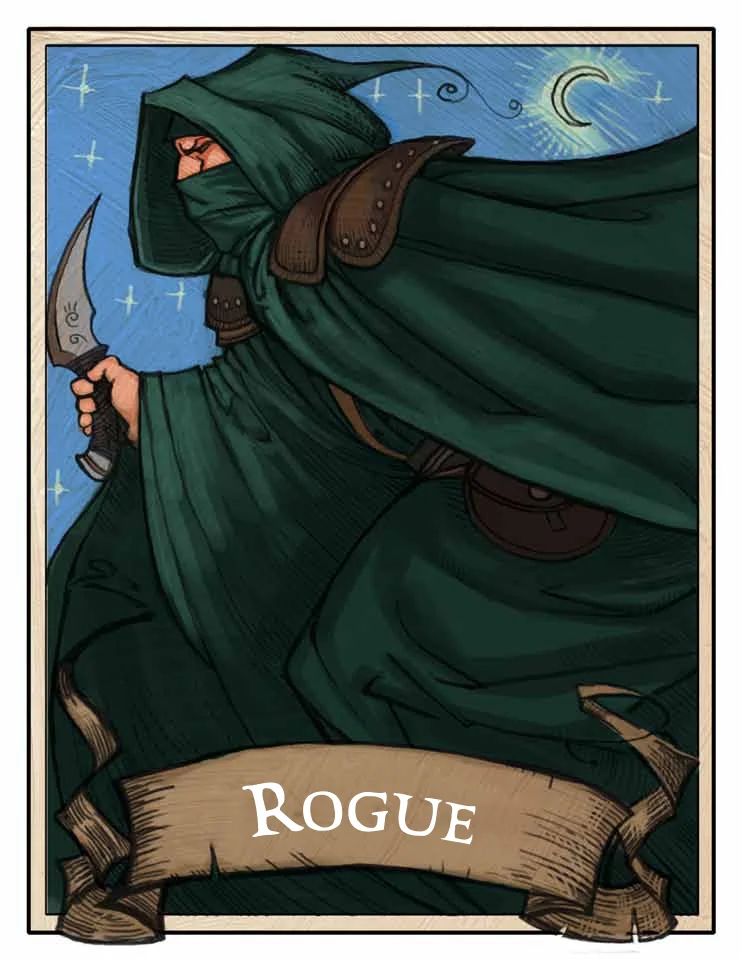
A nonplayer character of the DM's choice becomes hostile toward you. The identity of your new enemy isn't known until the NPC or someone else reveals it. Nothing less than a [wish](../spells/wish.md#.md#.md#) spell or divine intervention can end the NPC's hostility toward you.

### Jester
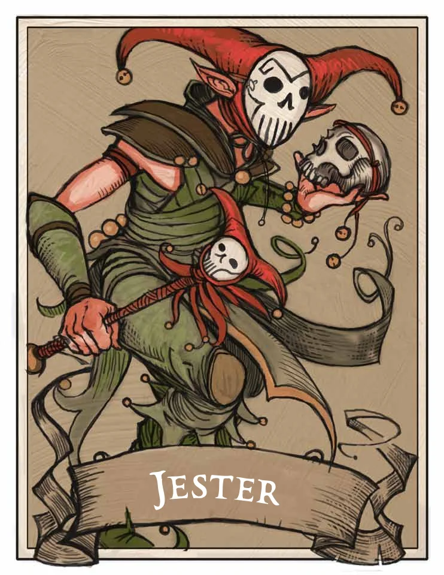
You gain 10,000 XP, or you can draw two additional cards beyond your declared draws.