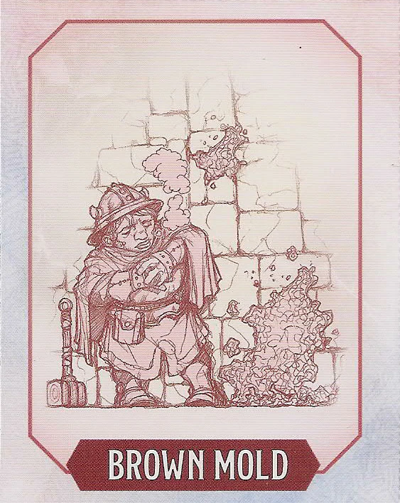
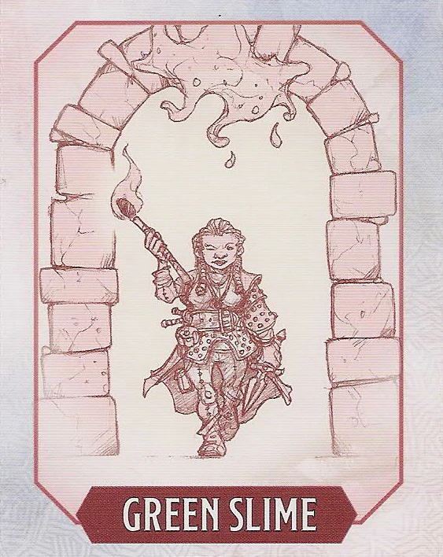
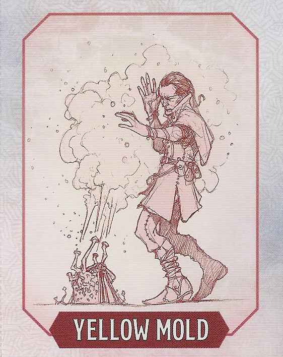

# Hazard Cards
*Source: Dungeon Master's Screen: Dungeon Kit*  

> [!note]
> These double-sided cards can be used to track hazards your players have encountered; either physically with the "printed copies", or in a VTT.

## Cards

### Brown Mold

> [!embed-hazard]- Brown Mold
> 

### Green Slime

> [!embed-hazard]- Green Slime
> 

### Yellow Mold

> [!embed-hazard]- Yellow Mold
> 