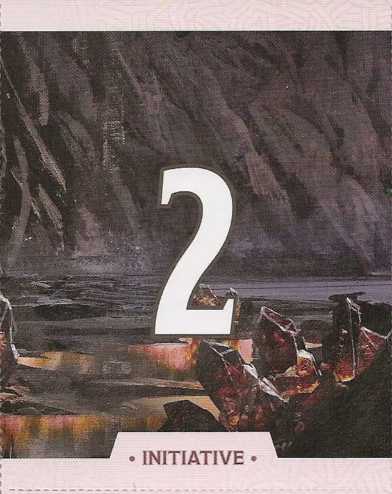
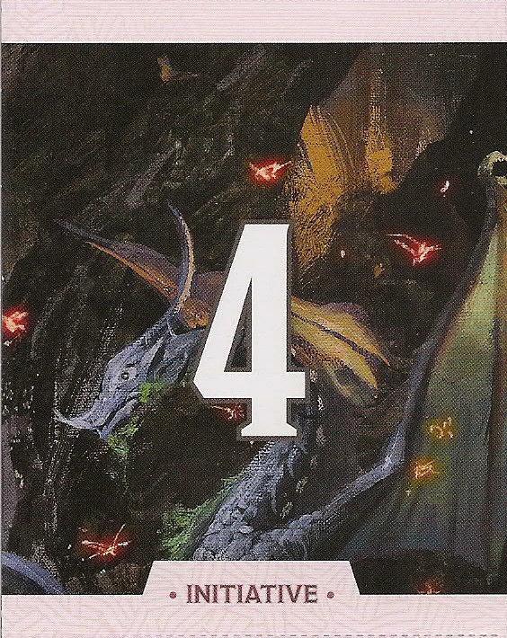
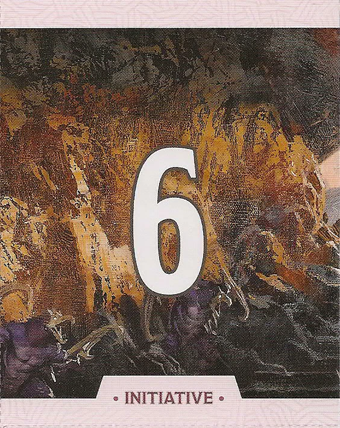

# Initiative Cards
*Source: Dungeon Master's Screen: Dungeon Kit*  

> [!note]
> These cards can be used to track initiative order; either physically with the "printed copies", or in a VTT.

## Cards

### One

You will go first in the initiative order.

### Two

You will go second in the initiative order.

### Three

You will go third in the initiative order.

### Four

You will go fourth in the initiative order.

### Five

You will go fifth in the initiative order.

### Six

You will go sixth in the initiative order.

### Seven

You will go seventh in the initiative order.

### Eight

You will go eighth in the initiative order.

### Nine

You will go ninth in the initiative order.