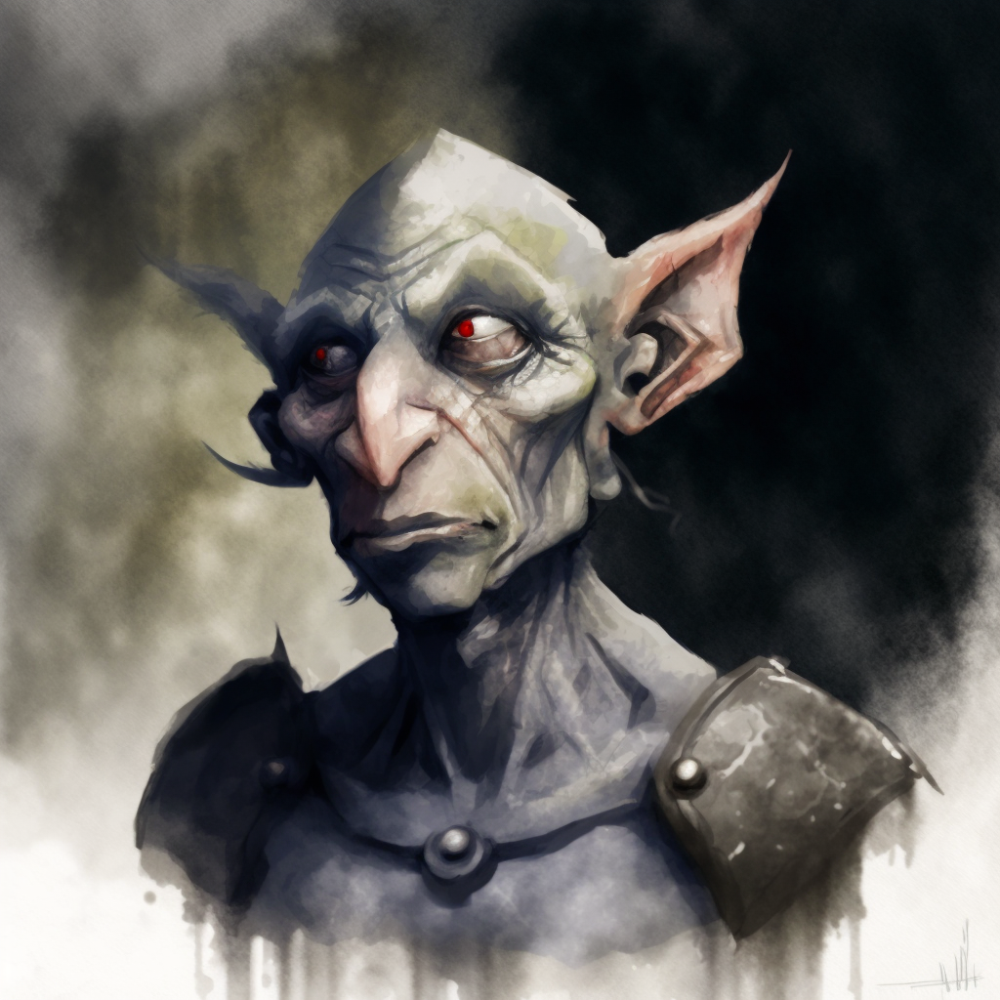

# Doloi

*Doloi*

  

- **Ability Scores**: Choose one of: (a) Choose any +2, choose any other +1; (b) Choose any +1, choose any other +1, choose any other +1
- **Creature Type**: race
- **Size**: Small or Medium
- **Speed**: 30 ft.

## Description

The Doloi are a nomadic race that dwells largely in forests and plains of the Faeir Wildes. The Doloi are of goblinoid heritage, but range widely in size, from three to five feet, and vary in skin color and features. Due to their heritage they are often seen as untrustworthy or even dangerous by other races, and may face prejudice and discrimination as a result.

## Traits

### Creature Type

You are a Humanoid. You are also considered a goblinoid for any prerequisite or effect that requires you to be a goblinoid.

### Darkvision

You can see in dim light within 60 feet of you as if it were bright light and in darkness as if it were dim light. You discern colors in that darkness only as shades of gray.

### Fey Ancestry

You have advantage on saving throws you make to avoid or end the charmed condition on yourself.

### Fey Gift

You can use this trait to take the Help action as a bonus action, and you can do so a number of times equal to your proficiency bonus. You regain all expended uses when you finish a long rest.

Starting at 3rd level, choose one of the options below each time you take the Help action with this trait:

- **Hospitality.** You and the creature you help each gain a number of temporary hit points equal to `1d6` plus your proficiency bonus.  
- **Passage.** You and the creature you help each increase your walking speeds by 10 feet until the start of your next turn.  
- **Spite.** Until the start of your next turn, the first time the creature you help hits a target with an attack roll, that target has disadvantage on the next attack roll it makes within the next minute.  

### Cunning Defense

When you are wearing no armor, your AC equals 10 + your Dexterity modifier + your Intelligence modifier.

### Crafty

 You have proficiency with your choice of one of the following sets of tools: alchemist's supplies, tinker's tools, leatherworker's tools, or poisoner's kit.

### Languages

You can speak, read, and write Common and one other language that you and your DM agree is appropriate for your character.