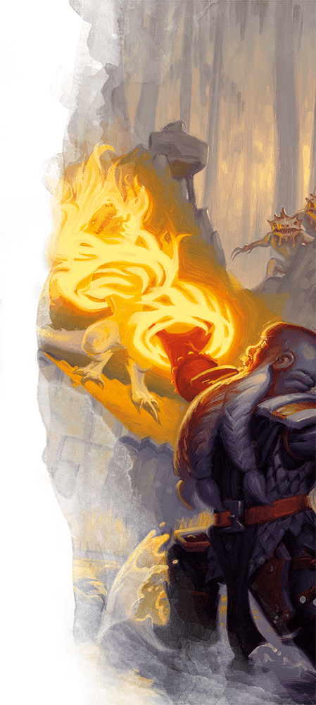

# Sacred Flame
*cantrip, Evocation*  
  

- **Casting time:** 1 action
- **Range:** 60 feet
- **Components:** V, S
- **Duration:** Instantaneous

Flame-like radiance descends on a creature that you can see within range. The target must succeed on a Dexterity saving throw or take `1d8` radiant damage. The target gains no benefit from cover for this saving throw.

The spell's damage increases by `1d8` when you reach 5th level (`2d8`), 11th level (`3d8`), and 17th level (`4d8`).

**Classes**: [Cleric](../classes/cleric.md#), [Sorcerer (Divine Soul)](../classes/sorcerer-divine-soul-xge.md#), [Warlock (The Celestial)](../classes/warlock-the-celestial-xge.md#)

Player's Handbook p. 272. Available in the SRD and the Basic Rules.