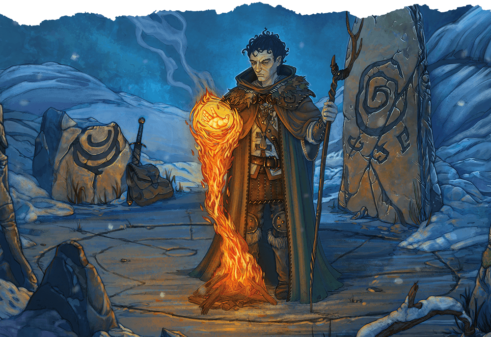

# Control Flames
*cantrip, Transmutation*  
  

- **Casting time:** 1 action
- **Range:** 60 feet
- **Components:** S
- **Duration:** Instantaneous,  up to 1 hour

You choose nonmagical flame that you can see within range and that fits within a 5-foot cube. You affect it in one of the following ways:

- You instantaneously expand the flame 5 feet in one direction, provided that wood or other fuel is present in the new location.  
- You instantaneously extinguish the flames within the cube.  
- You double or halve the area of bright light and dim light cast by the flame, change its color, or both. The change lasts for 1 hour.  
- You cause simple shapes—such as the vague form of a creature, an inanimate object, or a location—to appear within the flames and animate as you like. The shapes last for 1 hour.  

If you cast this spell multiple times, you can have up to three non-instantaneous effects created by it active at a time, and you can dismiss such an effect as an action.

**Classes**: [Cleric (Nature Domain)](../../classes/cleric-nature-domain.md#), [Druid (Circle of the Land)](../../classes/druid-circle-of-the-land.md#), [Druid](../../classes/druid.md#), [Fighter (Eldritch Knight)](../../classes/fighter-eldritch-knight.md#), [Rogue (Arcane Trickster)](../../classes/rogue-arcane-trickster.md#), [Sorcerer](../../classes/sorcerer.md#), [Wizard](../../classes/wizard.md#)

Xanathar's Guide to Everything p. 152